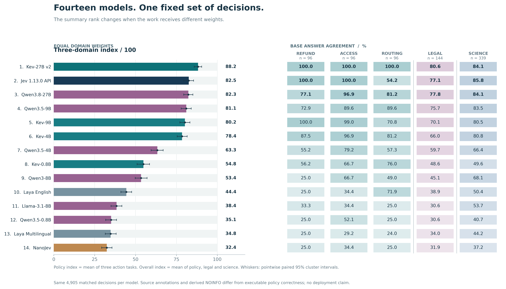
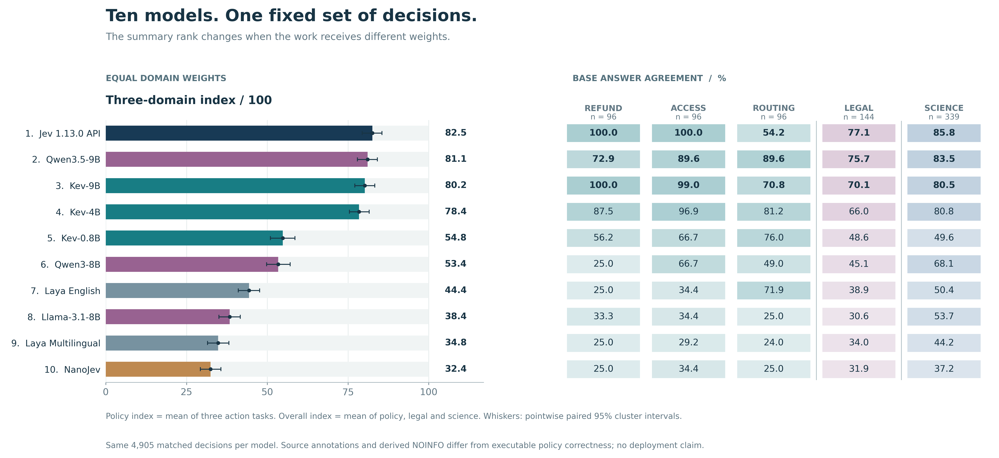
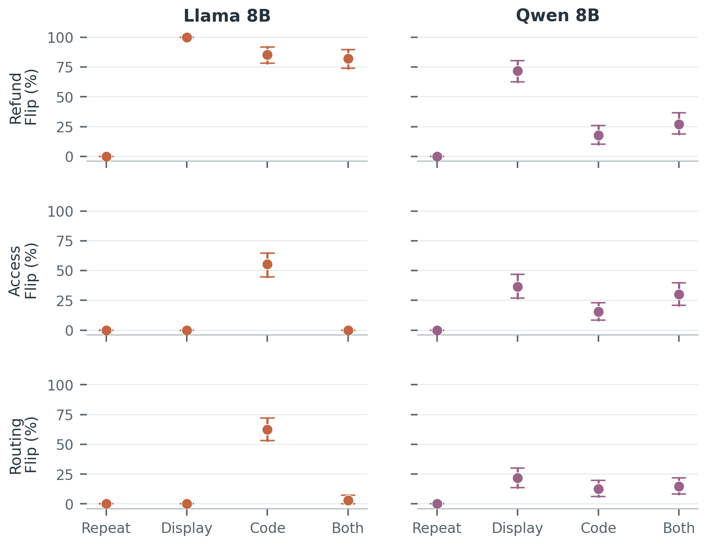

# System1Bench: Benchmarking Jev-Style Decision Models

[](https://github.com/CYMCharming/system1bench/actions/workflows/verify.yml)

**System 1 决策模型评测基准** · An independent, reproducible evaluation collection
for models that turn a supplied state into typed `choice`, `noul` and `score`
decisions.

**The historical full-matrix systems are Laya English, Laya Multilingual,
Llama-3.1-8B-Instruct, Qwen3-8B and the pinned Jev 1.13.0 API.**
**The new controlled expansion adds Kev-0.8B, Kev-4B, Kev-9B,
NanoJev (unified games) and Qwen3.5-9B.**
**The follow-up extension adds Kev-27B v2 and official Qwen3.5-0.8B/4B
and Qwen3.8-27B checkpoints on the same frozen requests.**
“Jev-style” describes the interface/task category, not a shared architecture.

System1Bench combines 15 public source datasets/collections into 36 suites and
controls. It covers semantic classification, bilingual inference, structured
workflow decisions, explicit out-of-scope intent detection, safety, long-context
retrieval and actual option-order perturbations. Scores stay separate by source
and reference quality. There is no blended “decision intelligence” score.
An independently frozen legal/scientific extension is reported separately from
this historical 15-source matrix.

- [Controlled speed results](docs/PERFORMANCE_RESULTS.en.md) · [timing protocol](docs/PERFORMANCE_PROTOCOL.md) · [performance audit](docs/PERFORMANCE_AUDIT.md)
- [Results in English](docs/RESULTS.en.md) · [中文结果](docs/RESULTS.zh-CN.md)
- [Dataset guide in English](docs/DATASETS.en.md) · [数据集中文解读](docs/DATASETS.zh-CN.md)
- [Protocol and metrics](PROTOCOL.md) · [dataset suitability review](docs/DATASET_REVIEW.md)
- [Machine-readable results](results/summary.json) · [CSV](results/metrics.csv)
- [v0.2 comparison integrity review](docs/BASELINE_AUDIT.md) · [original Laya review](docs/EXPERIMENT_AUDIT.md)
- [LLM comparison protocol](docs/LLM_BASELINES.md) · [local checkpoint verification](docs/LOCAL_CHECKPOINT_VERIFICATION.json)
- [Source pins](sources.json) · [additional source pins](external_sources.json)
- [Jev API results](docs/JEV_RESULTS.en.md) · [hosted execution deviations](research/JEV_RUN_LOG.md)
- [Research insights](research/INSIGHTS.en.md) · [fresh policy results](research/CONFIRMATION_RESULTS.en.md) · [研究进展与启发（中文）](research/RESEARCH_PROGRESS.zh-CN.md)
- [Natural-domain paired protocol](research/domain_expansion_v1/PROTOCOL.md) · [legal/science results](research/domain_expansion_v1/RESULTS.en.md) · [third-party data attribution](research/domain_expansion_v1/DATA_LICENSES.md)
- [Generative-baseline protocol](research/strong_baseline_v1/PROTOCOL.md) · [cross-domain complementarity](research/cross_domain_v1/RESULTS.en.md)

## Fourteen-model follow-up leaderboard

The [fourteen-model follow-up](research/leaderboard_v2/REPORT.zh-CN.md)
retains the original ten results and adds four independently measured,
revision-pinned checkpoints. Every model has the same 4,905 typed decisions
from 2,601 requests; the [new run verification](research/model_expansion_v2/verification.json)
replays exact case, gold-label and request-hash matches. The three-domain
index remains a descriptive navigation aid, while the separate domain and
robustness rankings preserve source-reference differences.



- [All ranked categories (中文)](research/leaderboard_v2/REPORT.zh-CN.md)
  · [CSV](research/leaderboard_v2/rankings.csv)
  · [scores and intervals](research/leaderboard_v2/scores.json)
  · [independent verification](research/leaderboard_v2/verification.json)
- [Three domains](paper/figures/fig_leaderboard_v2_domains.png)
  · [decision heads](paper/figures/fig_leaderboard_v2_heads.png)
  · [stability and factual response](paper/figures/fig_leaderboard_v2_robustness.png)
  · [same-size Kev–Qwen contrasts](paper/figures/fig_leaderboard_v2_paired.png)
  · [27B error overlap and oracle ceiling](paper/figures/fig_leaderboard_v2_overlap.png)
- [New model identities and protocol](research/model_expansion_v2/PROTOCOL.md)
  · [same-size paired results](research/model_expansion_v2/RESULTS.zh-CN.md)
  · [ranking definitions](research/leaderboard_v2/PROTOCOL.md)

Kev-27B v2 starts from the already post-trained Qwen3.8-27B base, whereas
the smaller Kev bases are Qwen3.5-Base. Kev-9B in the earlier leaderboard is
an older pinned release. Differences are measured on the same prompts but
are **not** controlled causal effects of size or model architecture. Qwen
uses direct candidate-code likelihood with thinking off; its generative
reasoning ceiling is outside this evaluation.

## Ten-model leaderboards (archived snapshot)

The [ten-model leaderboard](research/leaderboard_v1/REPORT.zh-CN.md) ranks the
five historical and five newly evaluated systems on exactly the same **4,905
decisions per model**. Its descriptive three-domain index equally weights
executable policy actions, ContractNLI labels and cited SciFact labels; it is
not a replacement for the separate-source historical benchmark. Jev 1.13.0
API leads this sample index at **82.5%**, followed by Qwen3.5-9B (**81.1%**)
and Kev-9B (**80.2%**). If the three individual policies and two natural tasks
instead receive equal weight, **Kev-9B leads at 84.1%**. Domain-specific
rankings and the reference-quality caveats matter more than either single rank.



- [All domain and capability rankings (中文)](research/leaderboard_v1/REPORT.zh-CN.md)
  · [downloadable CSV](research/leaderboard_v1/rankings.csv)
  · [exact scores and intervals](research/leaderboard_v1/scores.json)
- [Ranking and uncertainty protocol](research/leaderboard_v1/PROTOCOL.md)
  · [independent source-to-score verification](research/leaderboard_v1/verification.json)
- [Domain panels](paper/figures/fig_leaderboard_domains.png)
  · [decision-head panels](paper/figures/fig_leaderboard_heads.png)
  · [stability and counterfactual panels](paper/figures/fig_leaderboard_robustness.png)

## New official-model expansion

Five new pinned models completed **24,525 new decisions**, with complete inputs
and zero invalid outputs, on executable refund/access/routing rules, ContractNLI
and the cited SciFact three-label panel. An additional **6,912 new decisions**
compare Kev-4B and Kev-9B on previously unused policy states. This is a separate
controlled extension: the five new models have **not** yet rerun every row of the
historical 15-source matrix below. Historical same-payload comparisons are reused
with explicit source receipts, not counted as new inference.

- [中文结果与边界](research/model_expansion_v1/RESULTS.zh-CN.md) · [English results](research/model_expansion_v1/RESULTS.en.md)
- [结果驱动的论文 ideas（直白版）](research/model_expansion_v1/IDEAS.zh-CN.md)
- [Model identities, coverage and reproduction](docs/MODEL_EXPANSION.zh-CN.md)
- [New-seed replication: all six effects](research/model_expansion_replication_v1/RESULTS.en.md)
- [Input/model pins](research/model_expansion_v1/manifest.json) · [independent validation](research/model_expansion_v1/verification.json)
- [Same-payload historical context and receipts](research/model_expansion_v1/historical_context.json)


A stable answer may be stably wrong. On scientific evidence, NanoJev has zero
reversal flips but **213/339 wrong-and-stable** predictions. Its game-specialized
checkpoint makes this an out-of-domain transfer diagnostic, not a general-quality
verdict. Qwen3.5 has **283/339** base agreements vs Kev-4B's **274/339**, but
**250/339** vs **265/339** correct-and-stable reversal pairs; the sample ranking
changes, without a statistically secure superiority claim.


On new routing pairs, Kev-4B gets both actions correct in **68/96** cases, Kev-9B
in **56/96**. Refund joint success instead improves **82/96 → 96/96**. Routing's
pointwise interval excludes zero, but its six-effect guarded interval reaches
zero. These are checkpoint-specific workload shifts, not a causal size law;
training histories differ. Qwen uses direct code likelihood, thinking off.
See the reports for every head, class, confidence slice and counterexample.

## Beyond aggregate accuracy

The fresh policy diagnostic evaluates 288 base states, eight matched variants and
three output primitives on all five systems. Separate LLM controls change display
order and answer-code identity independently. In Llama access-control decisions,
changing only codes flips 55.2% of predictions, while changing both display and
codes flips none. Combined reversal can therefore hide sensitivity to its components.
These findings describe the fixed adapters, not an architectural cause.



Each policy/model uses 96 base clusters; whiskers are pointwise paired 95% intervals.
All conditions, including null and contrary effects, are retained in the
[fresh report](research/CONFIRMATION_RESULTS.en.md). The
[post-hoc error localization](research/POSTHOC_DIAGNOSTICS.en.md) and
[six-effect simultaneous-interval figure](paper/figures/fig_confirmation.svg)
provide complementary diagnostics. Synthetic policies test supplied-rule execution,
and have not received independent human construct or bilingual validation.

<!-- BEGIN GENERATED RESULTS -->
## Measured results — all tasks

**Every score below comes from our own model runs and API calls. No third-party model scores are copied.**

4 checkpoints × 26,450 decisions = **105,800 measured decisions**, including controls. Failures: **0**; complete inputs: **105,800/105,800**.

Laya uses native decision heads. The Llama and Qwen baselines use zero-shot constrained next-token answer selection; Qwen thinking is disabled. See the [exact comparison protocol](docs/LLM_BASELINES.md). These are fixed direct-decision baselines, not best-achievable LLM scores.

Values are accuracy against each source reference. **Teacher/synthetic and authored/AI-reviewed rows measure reference agreement**, not independently human-verified correctness. We publish all suites without an overall blended score. Full confidence intervals, F1, Brier/ECE, ordinal errors, language/length slices and timings are in the [report](docs/RESULTS.zh-CN.md), [CSV](results/metrics.csv) and [JSON](results/summary.json).

The pinned **Jev 1.13.0** hosted track adds **26,450 decisions** from 22,934 requests, with **8 invalid decisions counted as incorrect**. Full client payloads were sent; server tokenization is unverified. [Jev report and all intervals](docs/JEV_RESULTS.en.md).

New research: [paired insights](research/INSIGHTS.en.md), [fresh policy interventions and codebook controls](research/CONFIRMATION_RESULTS.en.md). Local GPU timing and hosted network observations are separate tracks.

### Main tasks (28 suites)

| Task | Decisions / model | Laya English | Laya Multilingual | Llama-3.1-8B-Instruct | Qwen3-8B | jev-1.13.0 | Reference |
|---|---:|---:|---:|---:|---:|---:|---:|
| ag_news | 1000 | 94.30% | 92.40% | 88.90% | 86.80% | 88.60% | dataset_provided |
| emotion | 1000 | 59.10% | 53.00% | 50.50% | 54.80% | 59.00% | dataset_provided |
| banking77 | 1000 | 55.30% | 51.20% | 54.10% | 66.80% | 79.90% | dataset_provided |
| boolq | 1000 | 84.60% | 77.70% | 64.80% | 83.50% | 92.60% | dataset_provided |
| boolq_choice | 1000 | 83.60% | 77.40% | 68.70% | 83.30% | 92.20% | dataset_provided |
| sst5 | 1000 | 34.60% | 29.50% | 32.00% | 45.70% | 56.50% | dataset_provided |
| sst5_choice | 1000 | 49.60% | 35.60% | 42.20% | 43.90% | 55.90% | dataset_provided |
| xnli_en | 1000 | 86.00% | 81.70% | 46.20% | 78.70% | 85.90% | dataset_provided |
| xnli_zh | 1000 | 61.50% | 74.30% | 40.50% | 69.10% | 73.60% | dataset_provided |
| massive_en | 1000 | 54.10% | 42.30% | 57.20% | 66.30% | 77.50% | dataset_provided |
| massive_zh | 1000 | 30.40% | 33.20% | 53.50% | 62.60% | 76.00% | dataset_provided |
| prompt_injections | 116 | 70.69% | 57.76% | 62.93% | 63.79% | 76.72% | dataset_provided |
| typed_decisions | 2000 | 36.35% | 34.90% | 51.20% | 55.50% | 73.90% | synthetic_teacher |
| jevbench_original | 72 | 70.83% | 41.67% | 75.00% | 83.33% | 98.61% | authored_or_AI_reviewed |
| jevbench_easy | 48 | 95.83% | 89.58% | 100.00% | 100.00% | 100.00% | authored_or_AI_reviewed |
| jevbench_hard | 111 | 29.73% | 32.43% | 34.23% | 46.85% | 72.07% | authored_or_AI_reviewed |
| reflexbench_reflex-public-choice-v1 | 95 | 58.95% | 46.32% | 60.00% | 84.21% | 93.68% | authored_or_AI_reviewed |
| jev_laya_triage | 501 | 62.48% | 55.69% | 75.65% | 80.04% | 90.02% | synthetic_teacher |
| jev_laya_moderation | 426 | 67.84% | 48.36% | 88.97% | 77.46% | 92.72% | synthetic_teacher |
| jev_laya_routing | 411 | 64.23% | 51.09% | 61.31% | 83.70% | 88.81% | synthetic_teacher |
| jev_laya_claims | 300 | 90.00% | 80.00% | 61.67% | 98.67% | 100.00% | synthetic_teacher |
| jev_laya_reviews | 300 | 70.67% | 42.33% | 83.00% | 87.00% | 87.67% | synthetic_teacher |
| jev_laya_guard | 292 | 60.62% | 33.22% | 88.01% | 83.22% | 93.84% | synthetic_teacher |
| jev_laya_multilingual | 256 | 57.81% | 62.50% | 94.53% | 98.44% | 100.00% | synthetic_teacher |
| jev_laya_needle | 900 | 50.22% | 47.44% | 77.89% | 87.78% | 95.22% | programmatic |
| clinc150_oos | 5500 | 55.73% | 64.76% | 55.20% | 67.78% | 89.51% | dataset_provided |
| turtlebench | 1532 | 42.62% | 41.64% | 42.17% | 44.19% | 74.02% | dataset_provided |
| aegis2_prompt | 1928 | 49.59% | 57.05% | 66.80% | 72.67% | 82.42% | human_prompt_annotation |

### Same-order repeats and reversed-option controls (8 suites)

| Task | Decisions / model | Laya English | Laya Multilingual | Llama-3.1-8B-Instruct | Qwen3-8B | jev-1.13.0 | Reference |
|---|---:|---:|---:|---:|---:|---:|---:|
| banking77_repeat | 100 | 49.00% | 44.00% | 62.00% | 72.00% | 81.00% | dataset_provided |
| banking77_reversed | 100 | 58.00% | 44.00% | 37.00% | 54.00% | 82.00% | dataset_provided |
| massive_en_repeat | 100 | 54.00% | 50.00% | 62.00% | 74.00% | 83.00% | dataset_provided |
| massive_en_reversed | 100 | 52.00% | 43.00% | 60.00% | 66.00% | 82.00% | dataset_provided |
| jevbench_original_repeat | 36 | 61.11% | 58.33% | 80.56% | 83.33% | 100.00% | authored_or_AI_reviewed |
| jevbench_original_reversed | 36 | 58.33% | 55.56% | 66.67% | 86.11% | 100.00% | authored_or_AI_reviewed |
| reflexbench_reflex-public-choice-v1_repeat | 95 | 58.95% | 46.32% | 60.00% | 84.21% | 94.74% | authored_or_AI_reviewed |
| reflexbench_reflex-public-choice-v1_reversed | 95 | 58.95% | 45.26% | 57.89% | 82.11% | 94.74% | authored_or_AI_reviewed |

### Option-order agreement

Agreement compares predictions on the same inputs; it is not accuracy. The LLM reversal also reassigns answer codes.

| Model / task | N | Original → repeat | Repeat → reversed |
|---|---:|---:|---:|
| Laya English / banking77 | 100 | 100.00% | 52.00% |
| Laya English / massive_en | 100 | 100.00% | 50.00% |
| Laya English / jevbench_original | 36 | 100.00% | 91.67% |
| Laya English / reflexbench_reflex-public-choice-v1 | 95 | 100.00% | 89.47% |
| Laya Multilingual / banking77 | 100 | 100.00% | 62.00% |
| Laya Multilingual / massive_en | 100 | 100.00% | 54.00% |
| Laya Multilingual / jevbench_original | 36 | 100.00% | 77.78% |
| Laya Multilingual / reflexbench_reflex-public-choice-v1 | 95 | 100.00% | 80.00% |
| Llama-3.1-8B-Instruct / banking77 | 100 | 96.00% | 35.00% |
| Llama-3.1-8B-Instruct / massive_en | 100 | 95.00% | 49.00% |
| Llama-3.1-8B-Instruct / jevbench_original | 36 | 100.00% | 77.78% |
| Llama-3.1-8B-Instruct / reflexbench_reflex-public-choice-v1 | 95 | 100.00% | 82.11% |
| Qwen3-8B / banking77 | 100 | 99.00% | 61.00% |
| Qwen3-8B / massive_en | 100 | 100.00% | 68.00% |
| Qwen3-8B / jevbench_original | 36 | 100.00% | 86.11% |
| Qwen3-8B / reflexbench_reflex-public-choice-v1 | 95 | 100.00% | 85.26% |

### Explicit out-of-scope detection (CLINC150 + OOS)

| Model | In-scope accuracy | OOS precision | OOS recall | OOS F1 |
|---|---:|---:|---:|---:|
| Laya English | 49.11% | 38.44% | 85.50% | 0.5304 |
| Laya Multilingual | 74.42% | 86.59% | 21.30% | 0.3419 |
| Llama-3.1-8B-Instruct | 52.51% | 41.91% | 67.30% | 0.5165 |
| Qwen3-8B | 65.93% | 57.52% | 76.10% | 0.6552 |

### Ordinal scoring (SST5, fixed 0–4 scale)

Lower MAE is better; within-one agreement allows an error of one scale point.

| Model | Argmax MAE ↓ | Expected-score MAE ↓ | Within one ↑ |
|---|---:|---:|---:|
| Laya English | 0.9270 | 0.9144 | 77.80% |
| Laya Multilingual | 1.3000 | 1.2946 | 58.70% |
| Llama-3.1-8B-Instruct | 1.0350 | 0.9999 | 71.30% |
| Qwen3-8B | 0.6560 | 0.6482 | 90.80% |

<!-- END GENERATED RESULTS -->

<!-- BEGIN GENERATED PERFORMANCE -->
## Controlled local decision speed — all workloads

These are our own new measurements on one A100 80GB PCIe, using the existing four adapters. Each cell shows the median over eight rounds and its 95% bootstrap interval. Encoding and structured-answer construction are included; model loading, network/queue time and validation are excluded. The full [performance report](docs/PERFORMANCE_RESULTS.en.md) includes p95, reference agreement, memory, token counts and limits. See the [frozen protocol](docs/PERFORMANCE_PROTOCOL.md) and [raw records](performance/v1/raw).

| Workload | Model | Batch 1 request p50 ms | Batch 8 requests/s | Batch 32 requests/s |
|---|---|---:|---:|---:|
| ag_news | Laya English | 10.38 [10.29, 18.35] | 441.20 [436.82, 444.37] | 573.63 [570.54, 582.44] |
| ag_news | Laya Multilingual | 8.51 [8.46, 8.94] | 696.15 [690.33, 703.78] | 1037.98 [910.16, 1048.95] |
| ag_news | Llama-3.1-8B-Instruct | 30.69 [30.39, 30.78] | 47.11 [46.67, 47.61] | 47.07 [46.89, 48.16] |
| ag_news | Qwen3-8B | 30.96 [30.71, 31.02] | 46.46 [45.26, 47.51] | 47.25 [47.13, 47.79] |
| boolq | Laya English | 10.30 [10.23, 10.32] | 257.19 [256.58, 261.75] | 249.67 [248.99, 255.97] |
| boolq | Laya Multilingual | 8.55 [8.50, 8.71] | 448.91 [372.81, 457.76] | 456.62 [451.39, 482.04] |
| boolq | Llama-3.1-8B-Instruct | 36.86 [36.53, 37.19] | 29.18 [29.00, 29.47] | 25.18 [25.15, 25.53] |
| boolq | Qwen3-8B | 33.51 [33.34, 33.71] | 27.81 [27.55, 28.07] | 23.78 [23.69, 23.89] |
| sst5 | Laya English | 10.27 [10.21, 10.41] | 516.73 [512.80, 520.98] | 805.83 [765.12, 823.88] |
| sst5 | Laya Multilingual | 8.47 [8.38, 8.53] | 746.61 [715.84, 752.40] | 1305.71 [1286.94, 1318.23] |
| sst5 | Llama-3.1-8B-Instruct | 29.20 [29.08, 29.31] | 54.06 [53.02, 54.85] | 57.68 [57.50, 58.33] |
| sst5 | Qwen3-8B | 29.27 [29.12, 29.36] | 55.05 [54.60, 56.62] | 56.30 [56.12, 57.19] |
| banking77 | Laya English | 12.66 [12.55, 12.74] | 165.13 [134.06, 168.60] | 180.98 [158.88, 185.87] |
| banking77 | Laya Multilingual | 9.93 [9.81, 10.09] | 265.39 [257.80, 267.94] | 295.38 [292.77, 300.42] |
| banking77 | Llama-3.1-8B-Instruct | 112.93 [111.15, 113.03] | 9.00 [8.99, 9.05] | 9.02 [9.00, 9.03] |
| banking77 | Qwen3-8B | 119.91 [118.15, 120.11] | 8.41 [8.41, 8.47] | 8.44 [8.43, 8.46] |
| massive_en | Laya English | 11.44 [11.35, 20.04] | 225.14 [221.28, 229.00] | 260.98 [205.78, 264.71] |
| massive_en | Laya Multilingual | 9.50 [9.36, 13.45] | 357.15 [292.98, 364.11] | 420.73 [414.38, 432.53] |
| massive_en | Llama-3.1-8B-Instruct | 91.18 [90.88, 91.29] | 12.02 [12.02, 12.06] | 12.25 [12.23, 12.26] |
| massive_en | Qwen3-8B | 96.01 [95.87, 96.06] | 11.35 [11.31, 11.44] | 11.60 [11.58, 11.60] |
| massive_zh | Laya English | 11.38 [11.34, 11.48] | 223.72 [218.93, 224.30] | 256.27 [249.63, 258.63] |
| massive_zh | Laya Multilingual | 9.48 [9.34, 17.08] | 360.41 [248.90, 366.44] | 424.18 [417.61, 435.98] |
| massive_zh | Llama-3.1-8B-Instruct | 91.15 [90.66, 91.19] | 12.02 [12.00, 12.03] | 12.31 [12.28, 12.32] |
| massive_zh | Qwen3-8B | 95.66 [95.44, 95.81] | 11.37 [11.35, 11.39] | 11.64 [11.63, 11.67] |
| clinc150_oos | Laya English | 21.37 [21.29, 21.68] | 58.55 [57.44, 58.76] | 61.65 [50.61, 62.48] |
| clinc150_oos | Laya Multilingual | 13.60 [13.49, 13.77] | 101.92 [100.23, 102.75] | 109.08 [106.06, 110.01] |
| clinc150_oos | Llama-3.1-8B-Instruct | 201.76 [201.59, 201.94] | 4.50 [4.50, 4.51] | 4.52 [4.50, 4.53] |
| clinc150_oos | Qwen3-8B | 214.74 [214.46, 215.18] | 4.17 [4.17, 4.18] | 4.21 [4.21, 4.23] |
| jev_laya_triage | Laya English | 13.89 [13.83, 19.89] | 121.58 [121.06, 122.84] | 124.05 [113.78, 125.68] |
| jev_laya_triage | Laya Multilingual | 9.30 [9.27, 9.43] | 225.77 [197.01, 228.87] | 244.28 [241.82, 246.21] |
| jev_laya_triage | Llama-3.1-8B-Instruct | 100.02 [99.51, 100.78] | 12.58 [12.46, 12.64] | 12.61 [12.55, 12.67] |
| jev_laya_triage | Qwen3-8B | 102.95 [102.66, 103.92] | 12.08 [11.99, 12.27] | 12.39 [12.35, 12.46] |
| needle_100 | Laya English | 11.96 [11.95, 12.00] | 234.66 [233.99, 235.23] | 269.75 [267.47, 270.78] |
| needle_100 | Laya Multilingual | 9.08 [9.00, 12.76] | 404.35 [336.13, 405.09] | 488.97 [404.88, 493.09] |
| needle_100 | Llama-3.1-8B-Instruct | 69.02 [68.65, 69.14] | 20.89 [20.86, 20.94] | 22.15 [22.14, 22.17] |
| needle_100 | Qwen3-8B | 72.63 [72.45, 73.39] | 20.26 [20.23, 20.33] | 21.75 [21.72, 21.78] |
| needle_1000 | Laya English | 34.79 [34.76, 34.83] | 39.37 [38.08, 39.49] | 41.13 [41.00, 41.22] |
| needle_1000 | Laya Multilingual | 18.30 [18.26, 18.37] | 75.38 [75.24, 75.66] | 79.72 [79.02, 80.03] |
| needle_1000 | Llama-3.1-8B-Instruct | 202.67 [202.39, 202.87] | 4.96 [4.95, 4.96] | 5.02 [5.00, 5.05] |
| needle_1000 | Qwen3-8B | 214.47 [213.60, 214.78] | 4.65 [4.64, 4.66] | 4.69 [4.69, 4.70] |
| needle_4000 | Laya English | 171.11 [170.28, 171.40] | 6.57 [6.55, 6.59] | 6.65 [6.63, 6.66] |
| needle_4000 | Laya Multilingual | 92.94 [92.84, 93.04] | 12.50 [12.46, 12.53] | 12.56 [12.52, 12.57] |
| needle_4000 | Llama-3.1-8B-Instruct | 705.78 [705.57, 706.11] | 1.15 [1.15, 1.15] | 1.16 [1.16, 1.16] |
| needle_4000 | Qwen3-8B | 758.71 [757.50, 759.77] | 1.06 [1.06, 1.06] | 1.07 [1.07, 1.07] |

Requests include all questions in a state. Fixed-batch throughput is completed requests divided by summed prediction time; it is not server capacity. No generated-token speed, optimal-serving-engine result, architecture-only speedup, or overall cross-task winner is claimed. Jev was not run in this resident-GPU track.

<!-- END GENERATED PERFORMANCE -->

## Run provenance

The original Laya measurements are retained from v0.1. The two LLM runs are
new in v0.2; no prior result is relabeled as a new run. Every model has
per-suite compressed raw predictions and a completed-run manifest:
[Laya English](results/english/metadata.json),
[Laya Multilingual](results/multilingual/metadata.json),
[Llama-3.1-8B-Instruct](results/llama31_8b_instruct/metadata.json),
[Qwen3-8B](results/qwen3_8b/metadata.json).

## Reproduce

Python 3.11+ and a CUDA GPU are required for the Laya runs. The reference run used
Python 3.12, PyTorch 2.7.1+cu118, Transformers 5.16.1 and Laya 0.3.20. Laya source
hashes and model byte hashes appear in each model's metadata. A shared environment with
incompatible PyTorch/Transformers versions may need a fresh virtual environment.

```bash
git clone https://github.com/CYMCharming/system1bench.git
cd system1bench
python -m venv .venv
source .venv/bin/activate
pip install -e '.[laya]'
python -m system1bench.download
python -m system1bench.prepare
CUDA_VISIBLE_DEVICES=0 python -m system1bench.run --model english --output my-results
CUDA_VISIBLE_DEVICES=0 python -m system1bench.run --model multilingual --output my-results
python -m system1bench.metrics --results my-results
python -m system1bench.report --results my-results
```

Downloads use immutable revisions and verify SHA256. Standard source data are
stored locally under `data/`; they are not covered by this repository's license.
The checked-in `results/` are the published runs. Use a new output directory for
a different environment, checkpoint, code or batch size. Interrupted suites are
rerun atomically; completed suites must match input/configuration fingerprints.

To verify/recompute the published numbers without downloading data or a model:

```bash
pip install -e .
python -m unittest discover -s tests -v
python -m system1bench.metrics
python -m system1bench.report
```

The compressed per-suite results contain source IDs, gold labels, raw answers,
probabilities, request hashes, token audits and per-batch timing. They omit
original text and rationale annotations. A reader can reconstruct requests from
pinned sources and recompute all published metrics independently.

Llama/Qwen reproduction, prompt conversion and probability semantics are documented in
[LLM_BASELINES.md](docs/LLM_BASELINES.md). These local baselines use the exact same frozen inputs.

## Add Jev or another model

Implement the adapter contract in [ADAPTERS.md](docs/ADAPTERS.md), then use
`--adapter your_package.module:Adapter --model your_model_name`. The runner passes
only state and questions; source references are separate. Keep native raw answers
and declare model/version, prompt conversion, probability semantics and input
budget limitations. No Jev credentials, paid API calls, mocked leaderboard runs
or copied third-party model scores are included.

## Interpretation

Classification accuracy is a component measure, not end-to-end agent success.
Several workflow references are synthetic/teacher labels; their scores measure
agreement. Public data may overlap model training, and AG News/BoolQ are known
training-task families for Laya. Chinese states mostly use English instructions.

Laya runs use an 8,192-token maximum and 4,096-token prompt-head budget, but
Laya internally caps each candidate description at 48 tokens. Read the actual
truncation audits and the **shared complete-input subset** before comparing
checkpoints. A larger configured budget alone does not prove full input retention.

## Citation

```bibtex
@misc{system1bench2026,
  author = {CYMCharming},
  title = {System1Bench: Benchmarking Jev-Style Decision Models},
  year = {2026},
  howpublished = {\url{https://github.com/CYMCharming/system1bench}},
  note = {Version 0.2; cite the commit and original datasets for reproducibility}
}
```

Code: MIT. External data/models retain their original terms; see [NOTICE.md](NOTICE.md).
