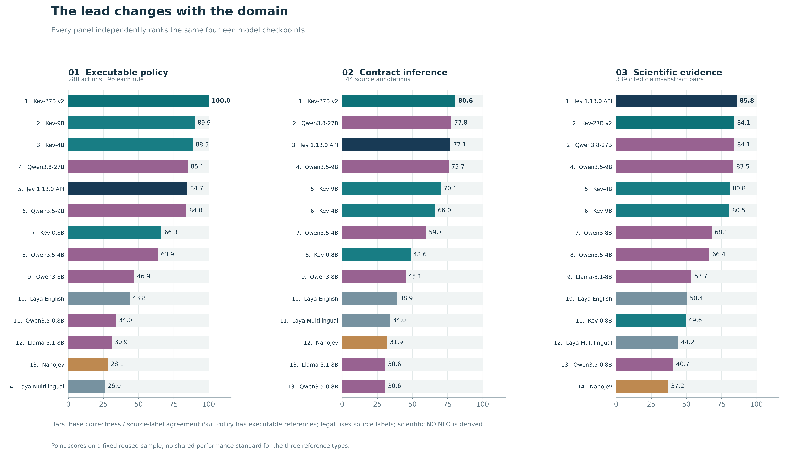
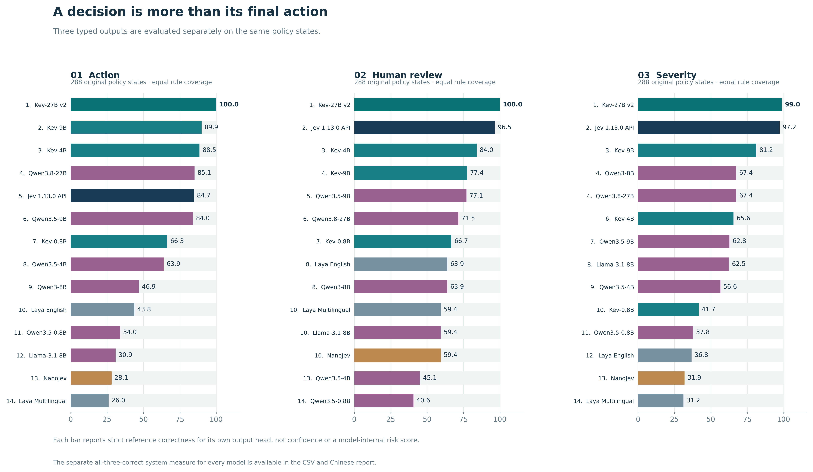
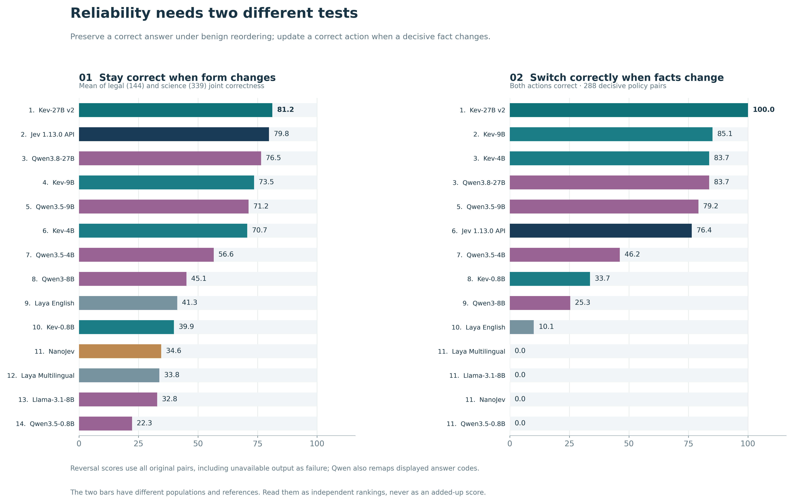
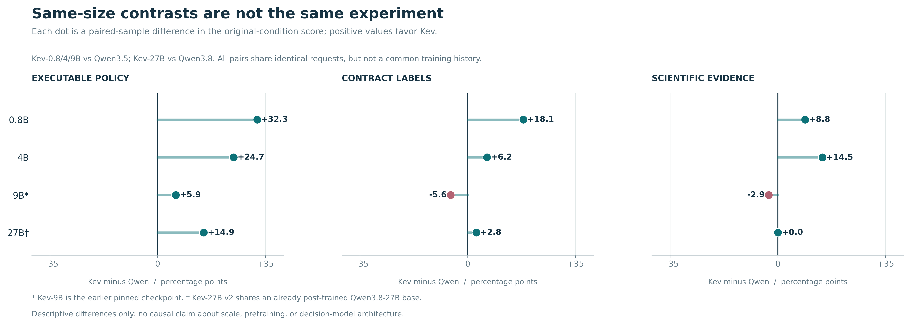
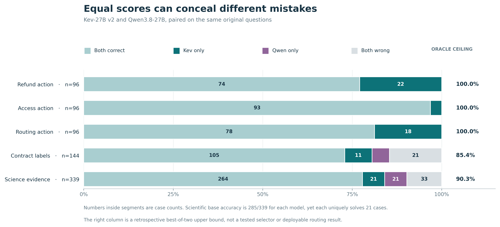

# 十四模型排行榜：同一批题目，按领域与决策能力展开

## 先看综合榜

三领域等权指数的样本第 1 名是 **Kev-27B v2，88.2%**；
若五个任务各给相同权重，榜首仍为 **Kev-27B v2，92.9%**。
本轮两种权重的榜首一致，但其他名次和分差会变化；综合分只供浏览，具体业务、法律、科学证据应分别选择模型。

三个政策领域（退款、权限、分流）的动作各 96 题，先等权平均成“业务规则”；随后业务、法律 144 题、科学 339 题各占综合指数三分之一。每个原始题目的答对为 1、错误为 0；没有用输出概率加权，也没有把同一题的重复和换序当新题。表格顺序按第一分数列排序；同分并列。

| 排名 | 模型 | 三领域等权综合分 | 业务动作 | 合同推断 | 科学证据 |
|---:|---|---:|---:|---:|---:|
| 1 | Kev-27B v2 | 88.2% | 100.0% (288/288) | 80.6% (116/144) | 84.1% (285/339) |
| 2 | Jev 1.13.0 API | 82.5% | 84.7% (244/288) | 77.1% (111/144) | 85.8% (291/339) |
| 3 | Qwen3.8-27B | 82.3% | 85.1% (245/288) | 77.8% (112/144) | 84.1% (285/339) |
| 4 | Qwen3.5-9B | 81.1% | 84.0% (242/288) | 75.7% (109/144) | 83.5% (283/339) |
| 5 | Kev-9B | 80.2% | 89.9% (259/288) | 70.1% (101/144) | 80.5% (273/339) |
| 6 | Kev-4B | 78.4% | 88.5% (255/288) | 66.0% (95/144) | 80.8% (274/339) |
| 7 | Qwen3.5-4B | 63.3% | 63.9% (184/288) | 59.7% (86/144) | 66.4% (225/339) |
| 8 | Kev-0.8B | 54.8% | 66.3% (191/288) | 48.6% (70/144) | 49.6% (168/339) |
| 9 | Qwen3-8B | 53.4% | 46.9% (135/288) | 45.1% (65/144) | 68.1% (231/339) |
| 10 | Laya English | 44.4% | 43.8% (126/288) | 38.9% (56/144) | 50.4% (171/339) |
| 11 | Llama-3.1-8B | 38.4% | 30.9% (89/288) | 30.6% (44/144) | 53.7% (182/339) |
| 12 | Qwen3.5-0.8B | 35.1% | 34.0% (98/288) | 30.6% (44/144) | 40.7% (138/339) |
| 13 | Laya Multilingual | 34.8% | 26.0% (75/288) | 34.0% (49/144) | 44.2% (150/339) |
| 14 | NanoJev | 32.4% | 28.1% (81/288) | 31.9% (46/144) | 37.2% (126/339) |

Kev-27B v2 在这批合成业务原题的动作上达到 288/288，关键事实改变后的成对动作也为 288/288。这个面板对该检查点已出现天花板：它证明这批明确规则执行得好，但不能再分辨更高难度的规则迁移、隐藏政策变化或真实部署表现。

综合分 95% 区间和全部精确数值见 [scores.json](scores.json)。区间对政策状态、合同文档、科学主张分别配对聚类抽样 5,000 次；它们是各模型自己的描述性区间，不能凭是否重叠断言模型间显著性，更不解决参考答案质量与多重比较问题。

## 换一种综合权重，名次怎么变

五任务等权的公式为：(退款 + 权限 + 分流 + 法律 + 科学) / 5；主榜则为：[(退款 + 权限 + 分流)/3 + 法律 + 科学] / 3。下表包含十四个模型，便于检查权重造成的名次变化。

| 排名 | 模型 | 五任务等权 | 三领域等权 |
|---:|---|---:|---:|
| 1 | Kev-27B v2 | 92.9% | 88.2% |
| 2 | Kev-9B | 84.1% | 80.2% |
| 3 | Jev 1.13.0 API | 83.4% | 82.5% |
| 4 | Qwen3.8-27B | 83.4% | 82.3% |
| 5 | Kev-4B | 82.5% | 78.4% |
| 6 | Qwen3.5-9B | 82.3% | 81.1% |
| 7 | Qwen3.5-4B | 63.6% | 63.3% |
| 8 | Kev-0.8B | 59.4% | 54.8% |
| 9 | Qwen3-8B | 50.8% | 53.4% |
| 10 | Laya English | 44.1% | 44.4% |
| 11 | Llama-3.1-8B | 35.4% | 38.4% |
| 12 | Qwen3.5-0.8B | 34.7% | 35.1% |
| 13 | Laya Multilingual | 31.3% | 34.8% |
| 14 | NanoJev | 30.7% | 32.4% |

## 按领域：业务规则、法律、科学证据

这是三张独立的榜。业务规则的参考答案可由规则程序核验；法律是来源标注一致率；科学的 NOINFO 意味着“引用摘要中无标注证据”，还未逐条得到独立人工确认。它们不能共享同一种“真值质量”。

## 业务细分：退款、权限、工单分流

| 排名 | 模型 | 退款动作 | 权限动作 | 分流动作 |
|---:|---|---:|---:|---:|
| 1 | Jev 1.13.0 API | 100.0% (96/96) | 100.0% (96/96) | 54.2% (52/96) |
| 1 | Kev-9B | 100.0% (96/96) | 99.0% (95/96) | 70.8% (68/96) |
| 1 | Kev-27B v2 | 100.0% (96/96) | 100.0% (96/96) | 100.0% (96/96) |
| 4 | Kev-4B | 87.5% (84/96) | 96.9% (93/96) | 81.2% (78/96) |
| 5 | Qwen3.8-27B | 77.1% (74/96) | 96.9% (93/96) | 81.2% (78/96) |
| 6 | Qwen3.5-9B | 72.9% (70/96) | 89.6% (86/96) | 89.6% (86/96) |
| 7 | Kev-0.8B | 56.2% (54/96) | 66.7% (64/96) | 76.0% (73/96) |
| 8 | Qwen3.5-4B | 55.2% (53/96) | 79.2% (76/96) | 57.3% (55/96) |
| 9 | Llama-3.1-8B | 33.3% (32/96) | 34.4% (33/96) | 25.0% (24/96) |
| 10 | Laya English | 25.0% (24/96) | 34.4% (33/96) | 71.9% (69/96) |
| 10 | Laya Multilingual | 25.0% (24/96) | 29.2% (28/96) | 24.0% (23/96) |
| 10 | Qwen3-8B | 25.0% (24/96) | 66.7% (64/96) | 49.0% (47/96) |
| 10 | NanoJev | 25.0% (24/96) | 34.4% (33/96) | 25.0% (24/96) |
| 10 | Qwen3.5-0.8B | 25.0% (24/96) | 52.1% (50/96) | 25.0% (24/96) |

## 同一状态下的三种输出

以下每项都是三个业务的 288 个原始状态。三项一起正确另列，避免把严重度分对但动作分错算成一个正确系统。

| 排名 | 模型 | 动作 | 需人工复核 | 严重度 | 三项同时正确 |
|---:|---|---:|---:|---:|---:|
| 1 | Kev-27B v2 | 100.0% (288/288) | 100.0% (288/288) | 99.0% (285/288) | 99.0% (285/288) |
| 2 | Kev-9B | 89.9% (259/288) | 77.4% (223/288) | 81.2% (234/288) | 58.7% (169/288) |
| 3 | Kev-4B | 88.5% (255/288) | 84.0% (242/288) | 65.6% (189/288) | 50.3% (145/288) |
| 4 | Qwen3.8-27B | 85.1% (245/288) | 71.5% (206/288) | 67.4% (194/288) | 36.1% (104/288) |
| 5 | Jev 1.13.0 API | 84.7% (244/288) | 96.5% (278/288) | 97.2% (280/288) | 79.2% (228/288) |
| 6 | Qwen3.5-9B | 84.0% (242/288) | 77.1% (222/288) | 62.8% (181/288) | 39.2% (113/288) |
| 7 | Kev-0.8B | 66.3% (191/288) | 66.7% (192/288) | 41.7% (120/288) | 20.8% (60/288) |
| 8 | Qwen3.5-4B | 63.9% (184/288) | 45.1% (130/288) | 56.6% (163/288) | 19.8% (57/288) |
| 9 | Qwen3-8B | 46.9% (135/288) | 63.9% (184/288) | 67.4% (194/288) | 23.3% (67/288) |
| 10 | Laya English | 43.8% (126/288) | 63.9% (184/288) | 36.8% (106/288) | 11.1% (32/288) |
| 11 | Qwen3.5-0.8B | 34.0% (98/288) | 40.6% (117/288) | 37.8% (109/288) | 4.2% (12/288) |
| 12 | Llama-3.1-8B | 30.9% (89/288) | 59.4% (171/288) | 62.5% (180/288) | 13.2% (38/288) |
| 13 | NanoJev | 28.1% (81/288) | 59.4% (171/288) | 31.9% (92/288) | 7.6% (22/288) |
| 14 | Laya Multilingual | 26.0% (75/288) | 59.4% (171/288) | 31.2% (90/288) | 8.0% (23/288) |

## 稳定与改判是两种不同能力

“换序后仍答对”只统计法律与科学中原题、换序题都答对的比例，两领域等权；“事实变后两次都对”只统计三个业务中原题与关键事实改变后的动作都答对的比例，三个业务等权。错误且不改答不算稳定成功。

| 排名 | 模型 | 换序前后都对 | 关键事实变化前后都对 |
|---:|---|---:|---:|
| 1 | Kev-27B v2 | 81.2% | 100.0% (288/288) |
| 2 | Jev 1.13.0 API | 79.8% | 76.4% (220/288) |
| 3 | Qwen3.8-27B | 76.5% | 83.7% (241/288) |
| 4 | Kev-9B | 73.5% | 85.1% (245/288) |
| 5 | Qwen3.5-9B | 71.2% | 79.2% (228/288) |
| 6 | Kev-4B | 70.7% | 83.7% (241/288) |
| 7 | Qwen3.5-4B | 56.6% | 46.2% (133/288) |
| 8 | Qwen3-8B | 45.1% | 25.3% (73/288) |
| 9 | Laya English | 41.3% | 10.1% (29/288) |
| 10 | Kev-0.8B | 39.9% | 33.7% (97/288) |
| 11 | NanoJev | 34.6% | 0.0% (0/288) |
| 12 | Laya Multilingual | 33.8% | 0.0% (0/288) |
| 13 | Llama-3.1-8B | 32.8% | 0.0% (0/288) |
| 14 | Qwen3.5-0.8B | 22.3% | 0.0% (0/288) |

## 同尺寸 Kev 与 Qwen 对照

图中 Kev 减 Qwen 的百分比点差值均来自同一批题的原题分数。9B 的 Kev 是旧版固定检查点；27B 的 Kev v2 则以已后训练的 Qwen3.8-27B 为基座。四组不是统一的训练控制实验，因此不能把图中差异归因于模型规模或决策架构。

27B 这对在科学原题上都答对 285/339，但各有 21 道题是只有自己答对。相同总分并不意味着错误重叠；图中的最佳二选一仅是事后神谕上界，尚无经独立新题验证的可用选择器。逐题四格整数表见 [新增模型结果](../model_expansion_v2/RESULTS.zh-CN.md)。

## 可比性与复查

十四个模型在本图上各对应相同的 4,905 个决策，逐请求摘要和标签均一致。先前十模型的历史运行是复用、并非此轮重新推断；Kev-4B/9B 后续额外做的新种子复测不混入榜单。全部输入与原始输出的逐项哈希见 [历史来源收据](../model_expansion_v1/historical_context.json)、[上一轮新增模型收据](../model_expansion_v1/verification.json)、[本轮新增模型收据](../model_expansion_v2/verification.json) 和 [本榜校验](verification.json)。

LLM 使用固定的直接候选答案接口，Qwen 未开启思考；这里没有检验它们生成式推理的最高成绩。Kev-27B v2 与 Qwen3.8-27B 同属 Qwen3.8 后训练基座；其他 Kev 比较涉及 Qwen3.5-Base 与后训练 Qwen、且 Kev-9B 是较早固定检查点，不能解释为干净的架构或规模效应。NanoJev 的检查点针对游戏训练；Jev 是在线 API，服务端词元化没有独立复核。不同版本的训练史与推断环境不同，速度和模型参数量不进入榜单。

下载可编辑数据：[各分类排行榜 CSV](rankings.csv) · [完整数值与置信区间 JSON](scores.json) · [计算规则](PROTOCOL.md)。图为可复现的 PDF/SVG/PNG 矢量与高分辨率版本；这是结果后的描述性组织方式，不是预先注册的获胜标准。
