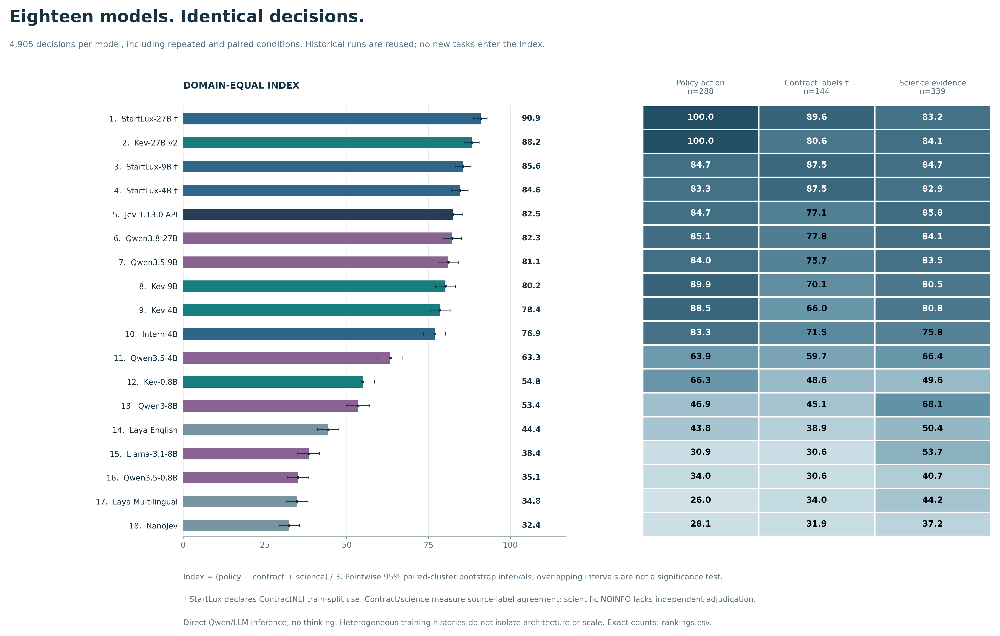
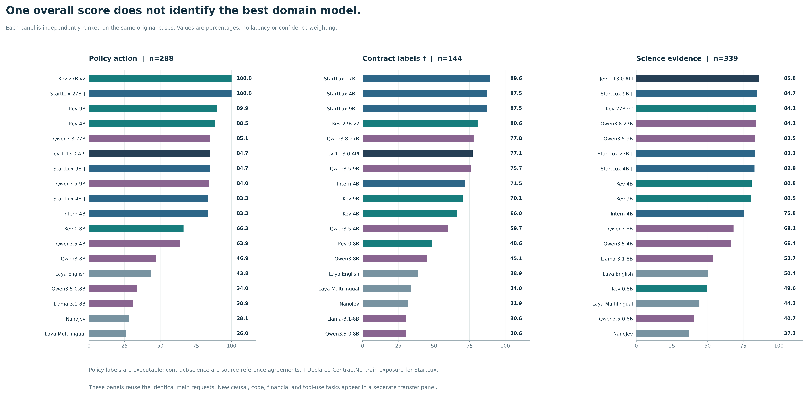
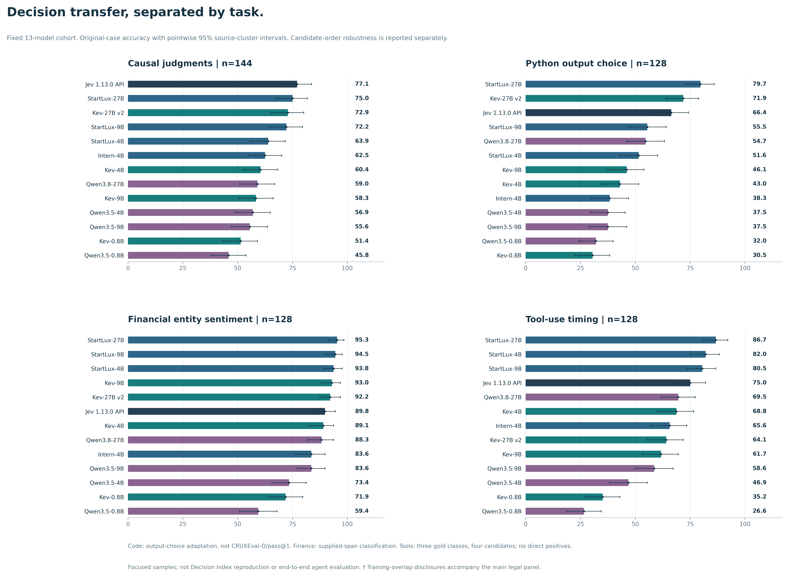
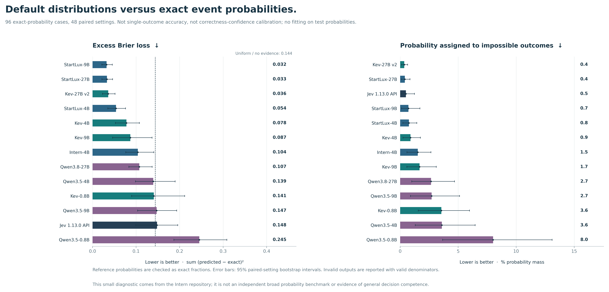

# 十八模型：综合与分类排行榜

新增 StartLux-Decision-4B/9B/27B 和 Intern-Decision-4B。每个模型对应相同4,905个决策；之前14个模型复用历史实测，未重跑、未改分。
综合分只用于浏览：业务动作、合同推断、科学证据各占三分之一；不加入新任务、速度或置信度。原题、反转题和同题多头不是独立样本。

† StartLux 官方声明训练用过 ContractNLI 训练子集，法律分数须带这个已知训练重叠背景；这不等于已证实测试泄漏。科学 NOINFO 是缺少标注证据，未独立逐题确认。
图中区间为5,000次配对聚类自助抽样的95%描述性区间，不能凭区间重叠判断模型差异显著；不同模型训练史也不构成受控架构对照。

| 排名 | 模型 | 综合分 /100 | 业务动作 % | 合同 % | 科学 % |
|---:|---|---:|---:|---:|---:|
| 1 | StartLux-Decision-27B † | 90.92 | 100.00 (288/288) | 89.58 (129/144) | 83.19 (282/339) |
| 2 | Kev-27B v2 | 88.21 | 100.00 (288/288) | 80.56 (116/144) | 84.07 (285/339) |
| 3 | StartLux-Decision-9B † | 85.63 | 84.72 (244/288) | 87.50 (126/144) | 84.66 (287/339) |
| 4 | StartLux-Decision-4B † | 84.57 | 83.33 (240/288) | 87.50 (126/144) | 82.89 (281/339) |
| 5 | Jev 1.13.0 API | 82.55 | 84.72 (244/288) | 77.08 (111/144) | 85.84 (291/339) |
| 6 | Qwen3.8-27B | 82.31 | 85.07 (245/288) | 77.78 (112/144) | 84.07 (285/339) |
| 7 | Qwen3.5-9B | 81.07 | 84.03 (242/288) | 75.69 (109/144) | 83.48 (283/339) |
| 8 | Kev-9B | 80.20 | 89.93 (259/288) | 70.14 (101/144) | 80.53 (273/339) |
| 9 | Kev-4B | 78.45 | 88.54 (255/288) | 65.97 (95/144) | 80.83 (274/339) |
| 10 | Intern-Decision-4B | 76.89 | 83.33 (240/288) | 71.53 (103/144) | 75.81 (257/339) |
| 11 | Qwen3.5-4B | 63.33 | 63.89 (184/288) | 59.72 (86/144) | 66.37 (225/339) |
| 12 | Kev-0.8B | 54.83 | 66.32 (191/288) | 48.61 (70/144) | 49.56 (168/339) |
| 13 | Qwen3-8B | 53.39 | 46.88 (135/288) | 45.14 (65/144) | 68.14 (231/339) |
| 14 | Laya English | 44.36 | 43.75 (126/288) | 38.89 (56/144) | 50.44 (171/339) |
| 15 | Llama-3.1-8B | 38.38 | 30.90 (89/288) | 30.56 (44/144) | 53.69 (182/339) |
| 16 | Qwen3.5-0.8B | 35.10 | 34.03 (98/288) | 30.56 (44/144) | 40.71 (138/339) |
| 17 | Laya Multilingual | 34.77 | 26.04 (75/288) | 34.03 (49/144) | 44.25 (150/339) |
| 18 | NanoJev | 32.41 | 28.12 (81/288) | 31.94 (46/144) | 37.17 (126/339) |

## 权重敏感性

| 排名 | 模型 | 五任务等权 /100 | 三领域等权 /100 |
|---:|---|---:|---:|
| 1 | StartLux-Decision-27B † | 94.55 | 90.92 |
| 2 | Kev-27B v2 | 92.93 | 88.21 |
| 3 | StartLux-Decision-9B † | 85.27 | 85.63 |
| 4 | Kev-9B | 84.09 | 80.20 |
| 5 | StartLux-Decision-4B † | 84.08 | 84.57 |
| 6 | Jev 1.13.0 API | 83.42 | 82.55 |
| 7 | Qwen3.8-27B | 83.41 | 82.31 |
| 8 | Kev-4B | 82.48 | 78.45 |
| 9 | Qwen3.5-9B | 82.25 | 81.07 |
| 10 | Intern-Decision-4B | 79.47 | 76.89 |
| 11 | Qwen3.5-4B | 63.55 | 63.33 |
| 12 | Kev-0.8B | 59.43 | 54.83 |
| 13 | Qwen3-8B | 50.78 | 53.39 |
| 14 | Laya English | 44.12 | 44.36 |
| 15 | Llama-3.1-8B | 35.39 | 38.38 |
| 16 | Qwen3.5-0.8B | 34.67 | 35.10 |
| 17 | Laya Multilingual | 31.28 | 34.77 |
| 18 | NanoJev | 30.70 | 32.41 |

## 细分任务

| 排名 | 模型 | 退款 % | 权限 % | 分流 % | 合同 % | 科学 % |
|---:|---|---:|---:|---:|---:|---:|
| 1 | Jev 1.13.0 API | 100.00 (96/96) | 100.00 (96/96) | 54.17 (52/96) | 77.08 (111/144) | 85.84 (291/339) |
| 1 | Kev-9B | 100.00 (96/96) | 98.96 (95/96) | 70.83 (68/96) | 70.14 (101/144) | 80.53 (273/339) |
| 1 | Kev-27B v2 | 100.00 (96/96) | 100.00 (96/96) | 100.00 (96/96) | 80.56 (116/144) | 84.07 (285/339) |
| 1 | StartLux-Decision-4B † | 100.00 (96/96) | 97.92 (94/96) | 52.08 (50/96) | 87.50 (126/144) | 82.89 (281/339) |
| 1 | StartLux-Decision-9B † | 100.00 (96/96) | 100.00 (96/96) | 54.17 (52/96) | 87.50 (126/144) | 84.66 (287/339) |
| 1 | StartLux-Decision-27B † | 100.00 (96/96) | 100.00 (96/96) | 100.00 (96/96) | 89.58 (129/144) | 83.19 (282/339) |
| 7 | Intern-Decision-4B | 95.83 (92/96) | 89.58 (86/96) | 64.58 (62/96) | 71.53 (103/144) | 75.81 (257/339) |
| 8 | Kev-4B | 87.50 (84/96) | 96.88 (93/96) | 81.25 (78/96) | 65.97 (95/144) | 80.83 (274/339) |
| 9 | Qwen3.8-27B | 77.08 (74/96) | 96.88 (93/96) | 81.25 (78/96) | 77.78 (112/144) | 84.07 (285/339) |
| 10 | Qwen3.5-9B | 72.92 (70/96) | 89.58 (86/96) | 89.58 (86/96) | 75.69 (109/144) | 83.48 (283/339) |
| 11 | Kev-0.8B | 56.25 (54/96) | 66.67 (64/96) | 76.04 (73/96) | 48.61 (70/144) | 49.56 (168/339) |
| 12 | Qwen3.5-4B | 55.21 (53/96) | 79.17 (76/96) | 57.29 (55/96) | 59.72 (86/144) | 66.37 (225/339) |
| 13 | Llama-3.1-8B | 33.33 (32/96) | 34.38 (33/96) | 25.00 (24/96) | 30.56 (44/144) | 53.69 (182/339) |
| 14 | Laya English | 25.00 (24/96) | 34.38 (33/96) | 71.88 (69/96) | 38.89 (56/144) | 50.44 (171/339) |
| 14 | Laya Multilingual | 25.00 (24/96) | 29.17 (28/96) | 23.96 (23/96) | 34.03 (49/144) | 44.25 (150/339) |
| 14 | Qwen3-8B | 25.00 (24/96) | 66.67 (64/96) | 48.96 (47/96) | 45.14 (65/144) | 68.14 (231/339) |
| 14 | NanoJev | 25.00 (24/96) | 34.38 (33/96) | 25.00 (24/96) | 31.94 (46/144) | 37.17 (126/339) |
| 14 | Qwen3.5-0.8B | 25.00 (24/96) | 52.08 (50/96) | 25.00 (24/96) | 30.56 (44/144) | 40.71 (138/339) |

## 多头决策

| 排名 | 模型 | 动作 % | 人工复核 % | 严重度 % | 三头同时正确 % |
|---:|---|---:|---:|---:|---:|
| 1 | Kev-27B v2 | 100.00 (288/288) | 100.00 (288/288) | 98.96 (285/288) | 98.96 (285/288) |
| 1 | StartLux-Decision-27B † | 100.00 (288/288) | 100.00 (288/288) | 99.31 (286/288) | 99.31 (286/288) |
| 3 | Kev-9B | 89.93 (259/288) | 77.43 (223/288) | 81.25 (234/288) | 58.68 (169/288) |
| 4 | Kev-4B | 88.54 (255/288) | 84.03 (242/288) | 65.62 (189/288) | 50.35 (145/288) |
| 5 | Qwen3.8-27B | 85.07 (245/288) | 71.53 (206/288) | 67.36 (194/288) | 36.11 (104/288) |
| 6 | Jev 1.13.0 API | 84.72 (244/288) | 96.53 (278/288) | 97.22 (280/288) | 79.17 (228/288) |
| 6 | StartLux-Decision-9B † | 84.72 (244/288) | 92.36 (266/288) | 94.44 (272/288) | 73.61 (212/288) |
| 8 | Qwen3.5-9B | 84.03 (242/288) | 77.08 (222/288) | 62.85 (181/288) | 39.24 (113/288) |
| 9 | StartLux-Decision-4B † | 83.33 (240/288) | 93.75 (270/288) | 91.67 (264/288) | 73.26 (211/288) |
| 9 | Intern-Decision-4B | 83.33 (240/288) | 80.21 (231/288) | 79.17 (228/288) | 56.94 (164/288) |
| 11 | Kev-0.8B | 66.32 (191/288) | 66.67 (192/288) | 41.67 (120/288) | 20.83 (60/288) |
| 12 | Qwen3.5-4B | 63.89 (184/288) | 45.14 (130/288) | 56.60 (163/288) | 19.79 (57/288) |
| 13 | Qwen3-8B | 46.88 (135/288) | 63.89 (184/288) | 67.36 (194/288) | 23.26 (67/288) |
| 14 | Laya English | 43.75 (126/288) | 63.89 (184/288) | 36.81 (106/288) | 11.11 (32/288) |
| 15 | Qwen3.5-0.8B | 34.03 (98/288) | 40.62 (117/288) | 37.85 (109/288) | 4.17 (12/288) |
| 16 | Llama-3.1-8B | 30.90 (89/288) | 59.38 (171/288) | 62.50 (180/288) | 13.19 (38/288) |
| 17 | NanoJev | 28.12 (81/288) | 59.38 (171/288) | 31.94 (92/288) | 7.64 (22/288) |
| 18 | Laya Multilingual | 26.04 (75/288) | 59.38 (171/288) | 31.25 (90/288) | 7.99 (23/288) |

## 保持正确与及时改判

| 排名 | 模型 | 自然任务换序两次都对 % | 业务事实变化两次都对 % |
|---:|---|---:|---:|
| 1 | StartLux-Decision-27B † | 86.38 | 100.00 (288/288) |
| 2 | StartLux-Decision-9B † | 85.29 | 76.39 (220/288) |
| 3 | StartLux-Decision-4B † | 84.11 | 73.26 (211/288) |
| 4 | Kev-27B v2 | 81.18 | 100.00 (288/288) |
| 5 | Jev 1.13.0 API | 79.78 | 76.39 (220/288) |
| 6 | Qwen3.8-27B | 76.47 | 83.68 (241/288) |
| 7 | Kev-9B | 73.51 | 85.07 (245/288) |
| 8 | Qwen3.5-9B | 71.25 | 79.17 (228/288) |
| 9 | Kev-4B | 70.68 | 83.68 (241/288) |
| 10 | Intern-Decision-4B | 69.82 | 73.61 (212/288) |
| 11 | Qwen3.5-4B | 56.58 | 46.18 (133/288) |
| 12 | Qwen3-8B | 45.14 | 25.35 (73/288) |
| 13 | Laya English | 41.26 | 10.07 (29/288) |
| 14 | Kev-0.8B | 39.90 | 33.68 (97/288) |
| 15 | NanoJev | 34.56 | 0.00 (0/288) |
| 16 | Laya Multilingual | 33.76 | 0.00 (0/288) |
| 17 | Llama-3.1-8B | 32.84 | 0.00 (0/288) |
| 18 | Qwen3.5-0.8B | 22.31 | 0.00 (0/288) |

换序指标是合同144对与科学339对的领域等权均值；业务事实变化是288个状态的联合正确率。稳定地答错不会获得正确奖励。

## 新领域另看，概率表达另看

新面板只有预先固定的13个代表模型，不与18模型主榜混为相同覆盖。细分类、成对换序、精确概率误差及所有分子/分母见 [新面板结果](../startlux_transfer_v1/RESULTS.zh-CN.md)。
Qwen 采用直接候选接口、未开启思考；Intern 使用官方 HF 与已发布温度。共享 GPU 和慢内核回退不支持速度结论。
下载：[完整数值与区间](scores.json) · [逐分类 CSV](rankings.csv) · [协议](PROTOCOL.md) · [原始输入绑定与验证](../startlux_transfer_v1/summary.json)。
另提供正常论文宽度的独立矢量图：[业务](../../paper/figures/fig_leaderboard_v3_paper_policy_action.pdf) · [合同](../../paper/figures/fig_leaderboard_v3_paper_legal.pdf) · [科学](../../paper/figures/fig_leaderboard_v3_paper_science.pdf) · [因果](../../paper/figures/fig_transfer_v1_paper_cladder.pdf) · [代码](../../paper/figures/fig_transfer_v1_paper_cruxeval.pdf) · [金融](../../paper/figures/fig_transfer_v1_paper_finentity.pdf) · [工具](../../paper/figures/fig_transfer_v1_paper_when2call.pdf) · [概率损失](../../paper/figures/fig_transfer_v1_paper_excess_brier.pdf)。
探索性研究线索：[行动与停止、事件信念与选择偏好、跨领域能力边界](../startlux_transfer_v1/INSIGHTS.zh-CN.md)。工具时机逐类别图保留所有分子/分母，不能用整体分数替代风险画像。
