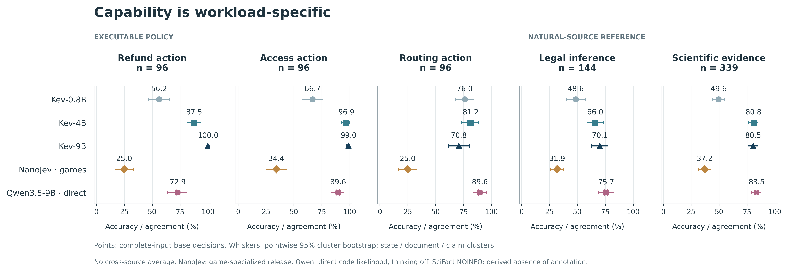
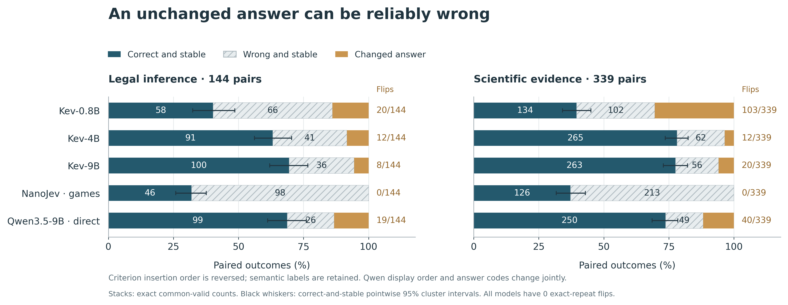
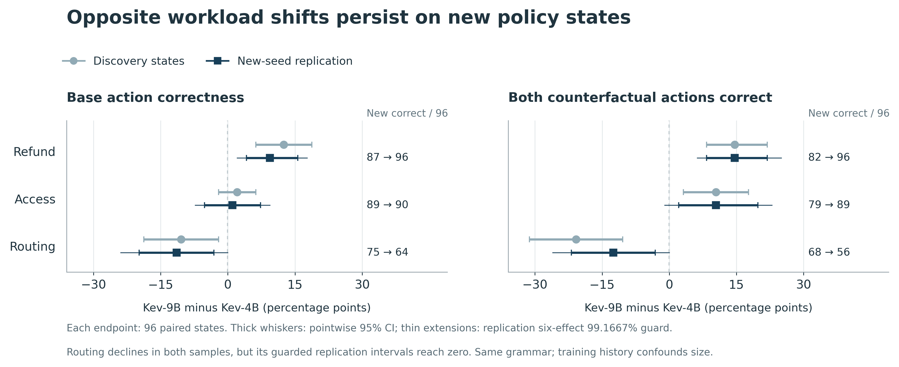

# 不是一个模型通吃：五个新增模型的实测结果

## 先说结果

- Kev-9B 在退款与权限动作上很强，但没有全面超过 Kev-4B。新题复测中，退款的变化前后联合答对率从 82/96 提升至 96/96，工单分流则从 68/96 降至 56/96。分流下降的方向重现了，但六项检验的保守区间仍触及零。
- “答案不变”不等于可靠。NanoJev 在 339 道科学证据题中换序后零改答，但有 213 道前后都错。这里测的是游戏专项模型跨领域迁移，不是它的游戏能力。
- 单次考试与变换后依旧答对，会给出不同的样本排名：科学题 Qwen3.5-9B 单次是 283/339，Kev-4B 是 274/339；换序前后都答对则分别是 250/339 和 265/339。区间仍有不确定性，不能宣布普遍优势。

本次首轮新增五个模型，每个 4,905 个决策；随后 Kev-4B/9B 各补做 3,456 个决策。共 **31,437 个新决策，错误/不可用输出为零**。这不是 31,437 道独立题：包含相同题的重复、换序、改变一个事实，以及一个状态上的多个输出头。旧模型的历史对照另行复用，未计入这个新增数量。

## 领域和答案来源分开看

| 测试 | 原始案例 / 模型 | 在问什么 | “正确”来自哪里 |
|---|---:|---|---|
| 退款 | 96 | 按明确规则决定退不退、是否复核、严重程度 | 两个可执行规则判定器 |
| 权限 | 96 | 按明确规则决定准入、是否复核、严重程度 | 两个可执行规则判定器 |
| 工单分流 | 96 | 按明确优先级派给正确部门、复核、严重程度 | 两个可执行规则判定器 |
| ContractNLI | 144，三类各 48 | 合同是否支持、反驳、未提及命题 | 原数据集标注；按合同文档聚类 |
| SciFact 引用对 | 339：支持 138、反驳 71、NOINFO 130 | 给定论文摘要能否支持或反驳主张 | 前两类是来源标注；NOINFO 是“没有标注证据”的派生类别 |

SciFact 的 NOINFO **尚不是独立人工确认的中立答案**。同一主张或合同文档可能对应多个案例，统计区间按主张 / 文档聚类；不能把这些列直接平均成“总智商”。这些冻结来源在此前研究中使用过，首轮是新模型迁移评测，不是新的隐藏测试集。

## 原始输入的动作准确率 / 来源答案一致率

| 模型 | 退款动作 | 权限动作 | 分流动作 | 法律推断 | 科学证据 |
|---|---:|---:|---:|---:|---:|
| Kev-0.8B | 54/96，56.3% | 64/96，66.7% | 73/96，76.0% | 70/144，48.6% | 168/339，49.6% |
| Kev-4B | 84/96，87.5% | 93/96，96.9% | 78/96，81.3% | 95/144，66.0% | 274/339，80.8% |
| Kev-9B | 96/96，100.0% | 95/96，99.0% | 68/96，70.8% | 101/144，70.1% | 273/339，80.5% |
| NanoJev，统一游戏版 | 24/96，25.0% | 33/96，34.4% | 24/96，25.0% | 46/144，31.9% | 126/339，37.2% |
| Qwen3.5-9B，直接决策 | 70/96，72.9% | 86/96，89.6% | 86/96，89.6% | 109/144，75.7% | 283/339，83.5% |

表内百分比按整数分子四舍五入；机器统计保留全精度。动作、复核、严重度是三个不同问题，完整分头指标、类别混淆、置信区间与概率指标在 [summary.json](summary.json)，不是只保留表现最好的一头。

## “稳”要拆成答对的稳和答错的稳

选项换序不是改变题意：例如把“支持、反驳、未提及”改成“未提及、反驳、支持”。原生接口改变候选插入顺序并保留语义标签；Qwen 的显示顺序与答案代码同时变化，因此不能把它称为纯粹的顺序因果实验。

| 科学题，339 对 | 两次都对且不变 | 两次都错且不变 | 改了答案 |
|---|---:|---:|---:|
| Kev-0.8B | 134 | 102 | 103 |
| Kev-4B | 265 | 62 | 12 |
| Kev-9B | 263 | 56 | 20 |
| NanoJev | 126 | 213 | 0 |
| Qwen3.5-9B | 250 | 49 | 40 |

三列恰好合计 339。五个模型在完全相同输入的精确重复条件下均零改答；这是这一固定推断流程的观测，不证明所有部署条件都确定。

Qwen3.5 减 Kev-4B：原始科学答案一致率差 **+2.65 个百分点**，按主张聚类的点态 95% 区间 **[−0.92, +6.43]**；换序前后联合答对率差 **−4.42 个百分点**，区间 **[−8.93, 0.00]**。样本排名变化是真的，但两种差异都不能当作严格确认的普遍优劣。这是探索性配对分析，不是六项复测的主检验。

## 更大版本的改进会不会只落在某些业务？

改变一个事实，例如超过退款截止日或出现紧急工单，程序确定正确动作必须改变。模型仅仅改了答案还不够：变化前后两个动作都必须正确。

首轮分流的联合答对，Kev-4B 为 75/96、Kev-9B 为 55/96，差 **−20.83 个百分点**，点态 95% 区间 [−31.25, −10.42]。因此在看到结果后，另注册了一个复测设计：三个新随机种子，剔除所有与首轮原始 / 改事实状态重复的事实与参数组合；每个业务 96 个新题对。新题仍使用相同规则模板，不代表新的规则领域或未知训练分布。

下面是复测的**全部六项主比较**，不是只挑分流。差均为 9B 减 4B，区间单位为百分点。

| 业务 / 指标 | 4B 答对 | 9B 答对 | 差 | 点态 95% 区间 | 六项保护的 99.1667% 区间 |
|---|---:|---:|---:|---|---|
| 退款 / 原始动作 | 87/96 | 96/96 | +9.38 | [+4.17, +15.63] | [+2.08, +17.71] |
| 退款 / 改事实前后都对 | 82/96 | 96/96 | +14.58 | [+8.33, +21.88] | [+6.25, +25.00] |
| 权限 / 原始动作 | 89/96 | 90/96 | +1.04 | [−5.21, +7.29] | [−7.29, +9.38] |
| 权限 / 改事实前后都对 | 79/96 | 89/96 | +10.42 | [+2.08, +19.79] | [−1.04, +22.92] |
| 分流 / 原始动作 | 75/96 | 64/96 | −11.46 | [−19.79, −3.13] | [−23.96, 0.00] |
| 分流 / 改事实前后都对 | 68/96 | 56/96 | −12.50 | [−21.88, −3.13] | [−26.04, 0.00] |

复测使用 20,000 次题对 bootstrap，固定随机种子。保护区间使用 Bonferroni 名义水平，是近似 bootstrap 区间，不是精确同时覆盖保证。退款提升证据较强；分流下降在两批样本方向相同，点态区间排除零，但更保守的复测区间触及零。Kev 各版本训练历史不同，不能把这称为“参数越大越差”的因果规律。

## 一个更细的探索性现象：三个输出未必一起对

首轮 Kev-9B 的分流严重度答对 86/96，但分流动作只对 68/96；其中有 **25/96** 个状态“严重度对、动作错”，有 11/96 个连复核判断也对而动作错。复测的“严重度对、动作错”是 **30/96**。这说明要审计输出之间的联合正确性，不能用一个风险分数代表整个业务动作可靠。它**不能证明模型内心‘知道但故意不做’**。

## 置信度也不是安全承诺

科学题中，Kev-4B 的最高候选概率 ≥0.9 的样本为 144/339，其中仍错 9/144；Kev-9B 为 175/339，其中错 13/175。覆盖率扩大，不等于自动决策风险降低。NanoJev 没有样本过这个阈值，其风险是“不适用”，不是零。Kev 用发行版自带温度，没有用本测试重新拟合；Qwen 的概率是候选答案代码的条件概率，不是已校准的“答对概率”。

## 结果怎么复查、哪些尚未做

原始输出和完整环境 / 权重 / 代码摘要在 `results/`，方案与模型版本在 [PROTOCOL.md](PROTOCOL.md)、[manifest.json](manifest.json)。独立核验不用分析器的整数统计函数，重查案例键、请求摘要、标签、概率分布、重复输入 token、联合答对和跨模型配对。远程完整输入重建已通过；公开 CI 只重放可发布原始输出，**不声称它重新看过未发布的授权数据文本**。

旧 Jev / Laya / Llama / Qwen3 各有 4,905 个完全同请求的历史结果对照，保留逐来源收据于 [historical_context.json](historical_context.json)。这些是历史复用，不是本轮重新调用，也不与新模型混合比较运行速度。

新增五模型还没有重跑历史 15 来源、36 套件的全部矩阵；Qwen3.5 思考 / 生成式强基线、本轮新自然数据人工复核、全新规则语法与受控速度实验也尚未完成。此轮 Qwen 为不启用思考的单步直接决策基线，NanoJev 是统一游戏检查点。复现与后续范围见 [模型指南](../../docs/MODEL_EXPANSION.zh-CN.md)。
