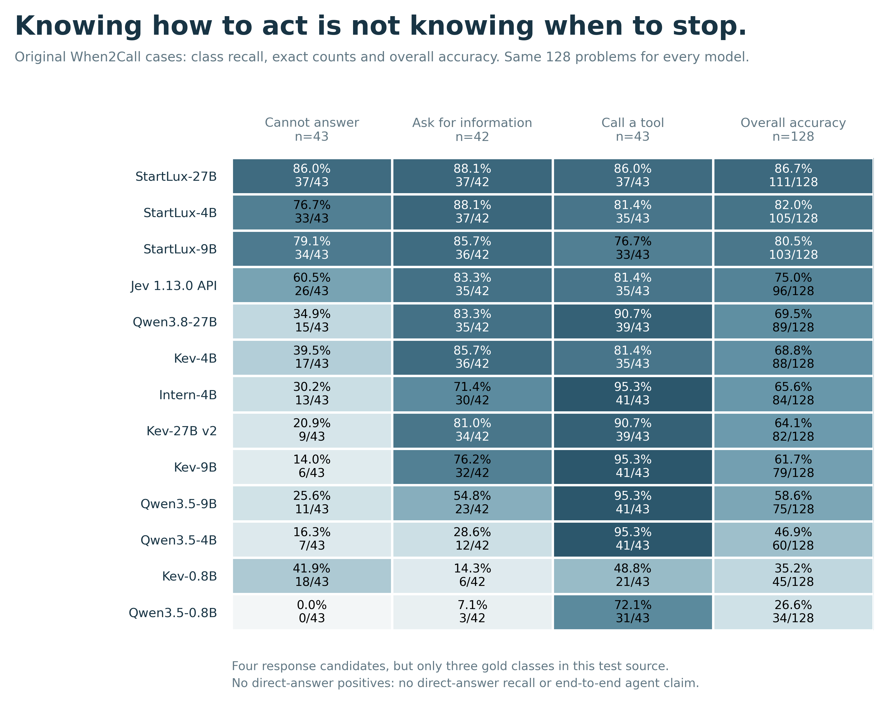

# 本轮实测给出的研究线索

本文件是探索性解读，不是预注册假设检验，也不把排行榜差异归因为模型架构。
证据来自 [完整结果](summary.json)、[新任务数值表](RESULTS.zh-CN.md)、
[18 模型主榜](../leaderboard_v3/REPORT.zh-CN.md)。区间是点位 95% 聚类 bootstrap，
未做多重比较校正。原有主榜与新增任务分开计分。

## 1. 会行动，不等于知道什么时候该停下

在同一组 When2Call 原始题上，Kev-27B v2 的“应调用工具”召回为
90.70%（39/43），“需询问更多信息”为 80.95%（34/42），而“当前无法回答”
只有 20.93%（9/43）。总准确率 64.06% 会掩盖这个明显不均衡的能力画像。
StartLux-27B 对这三类分别是 37/43、37/42、37/43；Jev 分别是
35/43、35/42、26/43。Jev 的最后一类包含一次无效返回，仍留在分母中。

直白地说：有些模型很会“去做点什么”，却不擅长识别“现在根本做不了”。
这比“哪个模型总分高”更接近真实决策风险，但当前数据不能证明真实部署会出现同样模式。

有价值的后续实验：给同一个任务逐步补齐工具、权限和必要信息，要求模型在
调用、追问、拒绝之间及时切换；测量“多做了不该做的事”的成本，以及补齐条件后
是否仍然拒绝。实验需要补上直接回答的正例和真实工具执行，本面板尚未覆盖。

## 2. 排除不可能，与准确表达可能性，是两回事

96 个精确概率案例、48 个配对设置中，Jev 给“不可能结果”的平均概率只有
0.50%，但整个分布的超额 Brier 为 0.1481。StartLux-9B 的不可能质量为
0.72%，超额 Brier 为 0.0322；StartLux-27B 为 0.41% 和 0.0330。
这些量衡量不同事情：一个模型可以几乎不给不可能结果概率，却把剩下的概率分得很不准确。

不读题、对全部候选均分概率的基线超额 Brier 为 0.1440。Jev 与它的逐题配对差
为 +0.0041，95% 区间 [-0.0794, +0.0753]；不能据此说 Jev 显著比均分更差。
StartLux-9B 的差为 -0.1118，区间 [-0.1670, -0.0660]。

关键限制：默认接口返回的“选中某答案的概率”不一定等于随机事件发生概率。
这组题也来自 Intern 仓库，不是独立大规模校准集。因此这不是“Jev 不会概率推理”的证据。
更有故事性的研究问题是：**决策分布到底表达世界的不确定性，还是模型的选择偏好？**

后续需要对比默认候选分布与显式概率报告，并改变收益而保持事件概率不变；
若概率随着奖励改变，说明选择策略和事件信念需要分开评测。
另已给出无拟合温度 1 敏感性分析：如 Intern 的损失由发布温度下 0.1041
变为 0.1801，说明概率排行榜也受接口温度影响，不能直接当作纯推理能力榜。
该分析只在已知发布温度的原生模型上进行，主成绩仍使用原发布接口。

## 3. 规则题的满分，不能替代跨领域能力

StartLux-27B 与 Kev-27B v2 都在原有 288 道业务动作题上达到 100%。
但新增代码输出选择题分别为 79.69%（102/128）与 71.88%（92/128），
工具时机分别为 86.72%（111/128）与 64.06%（82/128）。
另一方面，主榜最高的科学参考标签一致率是 Jev 的 85.84%，而新增因果判断
最高的点估计也是 Jev 的 77.08%（111/144）。后者与其他前列模型区间重叠，
不是已证明独占优势。

因此，合理的故事不是“决策模型全面碾压”，而是“不同训练目标形成不同的能力边界”。
当前直接接口下，StartLux-27B 相对 Qwen3.8-27B 的四个新任务准确率配对差
分别为 +15.97、+25.00、+7.03、+17.19 个百分点；点位区间见 JSON，
不能用这些差值隔离训练数据、训练方法或思考预算的作用。

后续适合做同一问题的连续难度阶梯：规则直接给出 → 从文本提取规则 →
处理冲突例外 → 信息不足 → 新领域迁移。观察优势在哪一步消失，才可能回答
“专门的决策训练究竟买到了什么”。

## 不能忘记的边界

- 主榜 18 个模型，新面板只有预先固定的 13 个代表模型，不声称所有 18 个模型跑过新任务。
- StartLux 声明使用过 ContractNLI 训练子集；合同成绩已标记来源层面的训练重叠，
  这不等于证明测试泄漏。新来源未出现在声明列表，也不等于已证明无污染。
- CRUXEval 为输出选择改编，不是自由生成 pass@1；FinEntity 为给定实体分类，
  不是实体抽取；When2Call 无直接回答正例，也未执行真实工具。
- Qwen/传统 LLM 采用不开思考的直接候选接口，不能代表其最佳可达表现。
  没有受控速度测量，不能从本轮推导效率优势。
- 本轮新增 34,596 次决策包含换序、重复条件和概率配对，不是 34,596 个独立样本。

来源版本、许可、剔除规则与接口修订见 [DATA_SOURCES.md](DATA_SOURCES.md)
和 [PROTOCOL.md](PROTOCOL.md)。
